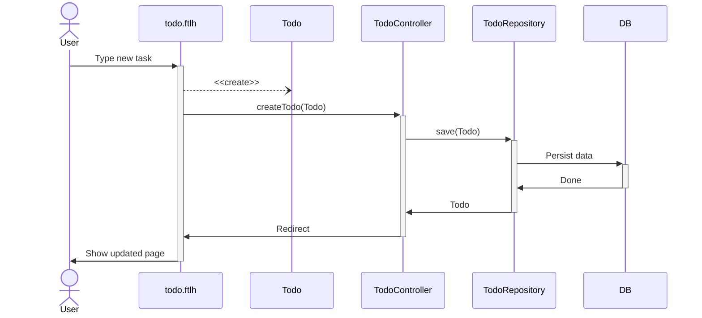

# MONOLITHIC JAVA WEB TO-DO APP
This project introduces a web To-Do app that allows adding, removing, and marking tasks as completed. 

We use this project in the [online certification Java program](http://pos-graduacao-ead.cp.utfpr.edu.br/java/), for the module I teach on Java for Web applications.

## Other Branches

This original project is extended in other branches, as follows:

- [project](https://github.com/gabrielcostasilva/java-todo/tree/project) is the empty project with all required dependencies for the main branch project.
- [persistence](https://github.com/gabrielcostasilva/java-todo/tree/persistence) creates the persistence layer for the project.
- [container](https://github.com/gabrielcostasilva/java-todo/tree/container) containerises the application within a Docker container. This branch also shows a much easier way to create containers with Spring Boot.
- [compose](https://github.com/gabrielcostasilva/java-todo/tree/compose) sets the application infrastructure using containers. In particular, it uses Docker Compose for orchestrating the container launch.
- [ci-cd](https://github.com/gabrielcostasilva/java-todo/tree/ci-cd) adds infrastructure as code (IaC) and CI features for using with AWS CodePipeline and AWS CloudFormation services.
- [beanstalk-container](https://github.com/gabrielcostasilva/java-todo/tree/beanstalk-container) sets specific configuration and artefacts for deploying the project using the [Amazon Beanstalk](https://aws.amazon.com/elasticbeanstalk/) console.
- [e2e-selenide](https://github.com/gabrielcostasilva/java-todo/tree/e2e-selenide) introduces a simple end-to-end test with [Selenide](https://selenide.org) for example purposes.
- [client-server-java](https://github.com/gabrielcostasilva/java-todo/tree/client-server-java) breaks down the application into a client-server architecture using REST to linking front- (client) and back- (server) end.

## Project Overview
The Figure below shows the only webpage in the application. From top to bottom, it consists of a title (_Todo App_), a text box for adding a new to-do (_Add a new to-do_), a list of existing to-dos (_To wash the car_, and _To tidy up the house_), and action buttons for adding (_Add_), deleting (_Delete_), or marking a to-do as done (_Mark as done_).

The webpage uses [Bootstrap](https://getbootstrap.com) 5.1.3 for styling components. Bootstrap is added to the project as a [WebJar](https://www.webjars.org) dependency, along with JQuery and Popper.js that are required for Bootstrap. 

This is a [server-side rendering](https://www.heavy.ai/technical-glossary/server-side-rendering) webpage, as usual for Java-based web applications. We use [FreeMarker](https://freemarker.apache.org) as our template engine for dynamically updating the page content on the server.

The code snippet below exemplifies the list of existing to-dos. To render existing to-dos, one needs to iterate over a list (line 25-37). To show the current to-do, we use interpolation at line 27, which replaces the variable with the current to-do. 

_Mark as done_ button is conditional - it appears according to the current task state (lines 29-33).  

The UML sequence diagram below depicts the process for creating a new to-do. The Spring Framework populates a new `Todo` instance with the task user typed into the webpage. The webpage ([todo.ftlh](./src/main/resources/templates/todo.ftlh)) calls the `createTodo(Todo)` method in the [`TodoController`](./src/main/java/com/example/demo/TodoController.java) class. The method is just a wrapper, annotated with the `org.springframework.web.bind.annotation.PostMapping` interface. The annotation exposes the method as a web controller. Then, the method sends the `Todo` to the [`TodoRepository`](./src/main/java/com/example/demo/TodoRepository.java) interface. The interface implements the [DAO pattern](http://www.corej2eepatterns.com/DataAccessObject.htm), providing management methods for persistent storage. Finally, the [H2 database](https://www.h2database.com/html/main.html) saves the persistent data.

## Dependencies

- Spring Web
- Spring Data JPA
- Freemarker
- Bootstrap, JQuery, and Popper.js
- Lombok
- H2

## Project Setup
You need Java 17 (at least) and [Maven](https://maven.apache.org/download.cgi) installed to run this project.

From your terminal, clone the project locally, go into the project folder, and run: `mvn spring-boot:run`

Then, access the Web app from your browser at: [`http://localhost:8080/`](http://localhost:8080/)

## Testing
You can run unit tests with: `mvn test`.
